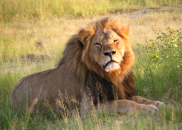
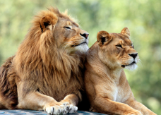

# Lion

Adult lions weigh approximately 170 - 300 kg.

In the wild lions live between 10 - 14 years.

Nearly all lions live in Africa below the sahara desert, but a few live in Gir Forest National park in western india.
 
Lions are the only big cats that live in a pride (a pride is a group of Lions). A pride can have up to 30 lions depending on how much food and water is available.

 

When living in a group, they can work together to hunt food. When having a social life, lions have competition between them. Usually the biggest and strongest male leads the pride.

Lions are really close to extinction. In the last ten years their numbers have gone down by 30%. 

A lion’s roar can be heard from 8km.

Like dogs, lions mark their scent with urine to border their home.

Lions mostly roar, but they make other noises to. Did you know they can meow, hiss and snarl too? Male lions are much bigger than females, and they have large manes, (hair), which covers their head and neck and stretches underneath to their belly.

Lion cubs have light spots on their fur when they are born. These fade when they grow up and they help camouflage or hide them when they’re young.

 Lions have incredible night vision, which increases their advantage when hunting at night!

Male lions relax and sleep all day, so the only time they’re not sleeping, is when they’re eating or defending their home.
