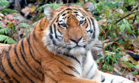

# Tiger

Tigers are the biggest big cats known to humans they can reach up to  3.7 meters in length. Tigers can weigh up to 300kg.

Did you know a Tiger can only run up to half the speed of a cheetah, a tiger can run up to 65 km/h and a cheetah can run up to 130 km/h! But tigers a much more Aggressive and dangerous.

 There are nine subspecies of tigers.

  

 1. Amur tiger. The Amur tiger is the largest tiger subspecies in the world Males can grow up to 3.3 m (10.5 feet) from head to toe and can weigh up to 300kg  females are smaller and can reach up to 2.6m (8.5 feet) from head to toe and can weigh up to 167 kg.

 2. Bengal tiger. the bengal tiger is the most common tiger there are Approximately 3700. The bengal tiger lives in Sundarbans mangrove in India.

 3. South china Tiger. The south China tiger Can be found in central and eastern china There are 47 tigers split up into 18 zoos in china and in the wild the exact number of tigers are unknown.

 4. Malayan tiger. The Malayan tiger was only identified from a separate subspecies to the Indochinese tiger in 2004. It’s very similar to the Indochinese tiger but smaller in size.

 5. Indochinese tiger. The Indochinese tiger is a subspecies found in Cambodia, Laos, Burma, Thailand, and Vietnam and formerly in China. They are listed as endangered on the IUCN Red List.

 6. Sumatran tiger. The Sumatran tiger is only found on an Island in Indonesia called Sumatra Sumatran tigers are protected by law in Indonesia, The Sumatran tiger has the Darkest coats of all tigers.

 Bali tiger. The Bali tiger is one of the three subspecies that are extinct.The Bali tiger  went extinct in the 1040 The causes of extinction include hunting, loss of forest habitat and loss of their prey base. None of these tigers exist in captivity.

8. Javan tiger. The javan tiger went extinct in the 1940 and lived on an island in Indonesia called Java.

9. Caspian tiger. The Caspian tiger went extinct in the 1980’s. Caspian Tigers and their large ungulate prey were found in the sparse forest habitats and riverine corridors west (Turkey) and south (Iran) of the Caspian Sea and west through Central Asia into the Takla Makan desert of Xinjiang, China,
